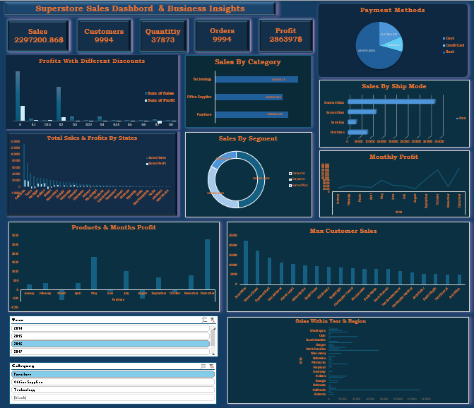

# 📊 Excel SuperStore Sales Dashboard

An interactive **SuperStore Sales Dashboard** built in Excel, featuring KPIs, PivotTables, and dynamic Slicers for data analysis.

---

## 📁 Files Included

- **Superstore.xlsx** → Main Excel file with all dashboards and KPIs.
- **SuperStore_Dashbord.png** → Screenshot preview of the dashboard.
- **Superstore_Data.csv** → SuperStore Sales Data Source.

---

## 🧠 Dashboard Features

✅ **KPIs**
- Total Sales  
- Total Profit  
- Orders Count  
- Profit Margin  

✅ **Visuals**
- Line Chart: Sales Trend (Month-Year)  
- Pie Chart: Sales by Segment  
- Column Chart: Max Customers Profit
- Slicers: Year, Segment  

✅ **Interactivity**
All charts and KPIs update automatically when you use the Slicers.

---

## 🧰 How to Use
1. Download the Excel file:  
   `Superstore.xlsx`
2. Open it in Microsoft Excel.
3. Use the Slicers (Year, Segment) to filter results interactively.

---

## 📸 Preview

---

## 🏷️ Author
**Mostafa Nasser**  
📧 moustafa4businesses@gmail.com  
💼 [LinkedIn Profile](https://linkedin.com/in/mostafa-nasser-876442322/)
